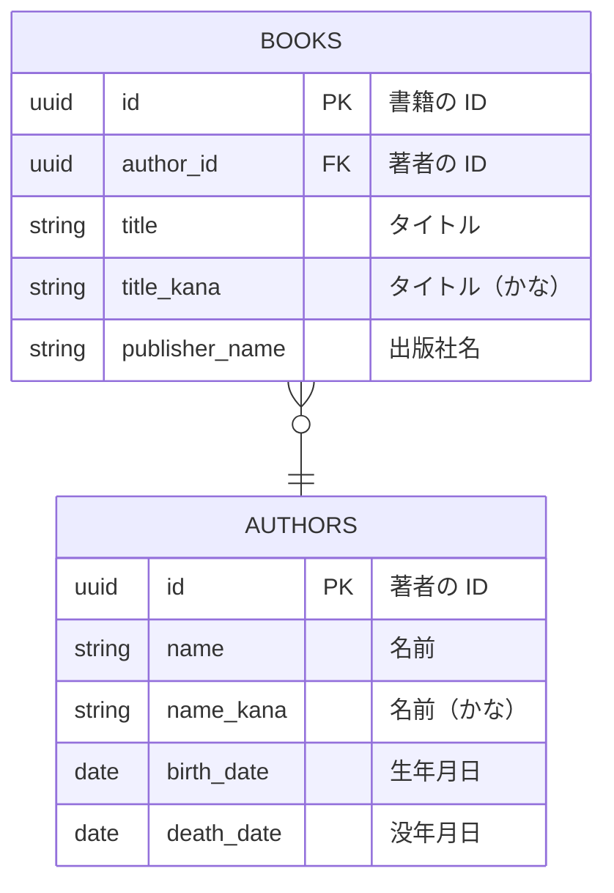

# book-service

書籍と著者の情報を管理・検索する Web API のシステムです。

## 環境

- Java 21
- Kotlin 1.9.23
- Spring Boot 3.2.5

## プロジェクト構成

Gradle のマルチプロジェクト構成です。

- book-service
  - book-service-core
    - エンティティを実装。リポジトリのインタフェースを定義。
  - book-service-db
    - Flyway によるマイグレーションの管理とリポジトリの実装。jOOQ のソースコードを生成。
  - book-service-webapi
    - Web API の実装。

## データモデル



## ローカル開発環境

[青空文庫](https://www.aozora.gr.jp/index_pages/person_all.html)で公開されている「公開中　作家別作品一覧拡充版：全て(CSV形式、UTF-8、zip圧縮）」をダウンロードして ZIP ファイル内の `list_person_all_extended_utf8.csv` を `book-service-db/src/test/resource/testdata` に配置することで、ローカル開発環境にテストデータが登録されます。

以下の Gradle タスクで Docker Compose を利用したローカル開発環境（PostgreSQL）の起動と DB のマイグレーションを行います。

```shell
./gradlew localDevUp
```

終了タスクの実行。

```shell
./gradlew localDevDown
```

## コード生成

```shell
./gradlew :book-service-db:jooqCodegen
```

## テスト

事前に [jOOQ のソースコード生成](#コード生成)が必要です。

```shell
./gradlew test
```

## Web API の実行

事前に[ローカル開発環境の起動](#ローカル開発環境)が必要です。

```shell
./gradlew :book-service-webapi:bootRun --args='--spring.profiles.active=local'
```
